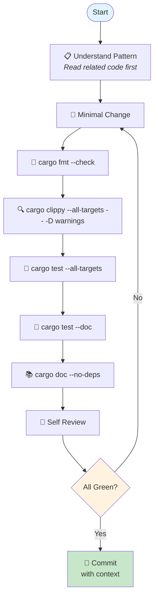
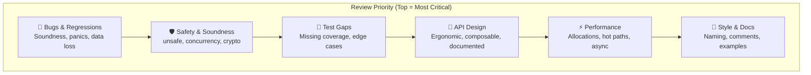
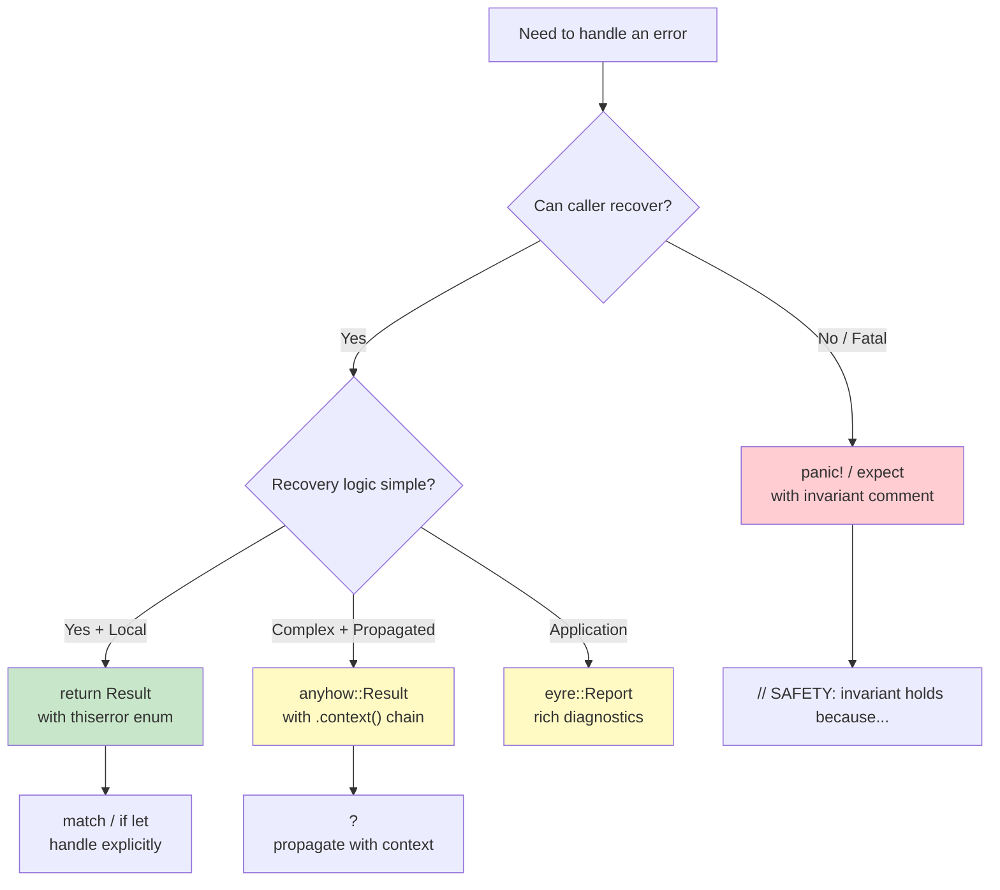
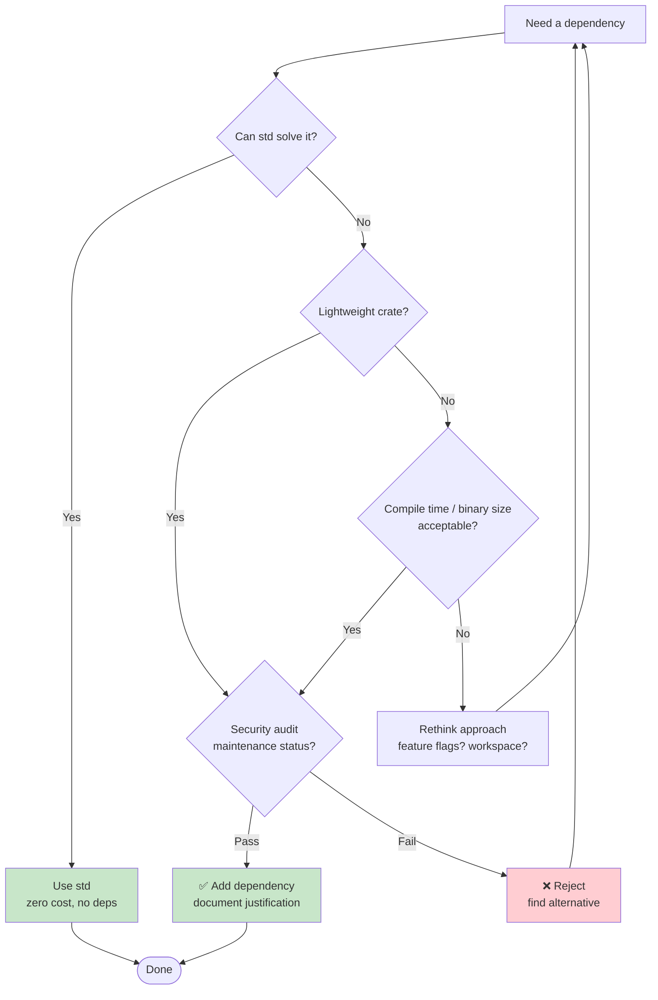

# craft-rust-maintainer 🦀

> A CRAFT harness for Rust code maintenance, review, and release hygiene.

## Philosophy

**"Safe, maintainable, and reviewable Rust."**

This cartridge enforces:
- **std-first thinking** — Can the standard library solve this?
- **Explicit error handling** — No silent failures, no panics without invariants
- **Comprehensive testing** — Unit, integration, property, and doc tests
- **Strict verification gates** — `fmt`, `clippy`, `test`, `doc` before any change is "done"

---

## Quick Start

```bash
# Install
craft harness install github:Rosavera-I/craft-rust-maintainer

# Review your code
craft run rust-maintainer --prompt "Review the network module for panics"

# Compose with TDD harness for test-driven refactor
craft compose rust-maintainer tdd-architect -o craft.compose.toml
craft run craft.compose.toml --prompt "Refactor error handling in the parser"
```

---

## Maintenance Workflow



---

## Code Review Priority Pyramid



---

## Error Handling Decision Tree



---

## Dependency Evaluation Flow



---

## Pattern Library

### ✅ Do: Error types with context
```rust
use thiserror::Error;

#[derive(Error, Debug)]
pub enum ParseError {
    #[error("invalid syntax at line {line}: {message}")]
    InvalidSyntax { line: usize, message: String },
    
    #[error("unexpected EOF, expected {expected:?}")]
    UnexpectedEof { expected: &'static str },
    
    #[error("IO error: {0}")]
    Io(#[from] std::io::Error),
}

// Call site gives context
pub fn parse_config(path: &Path) -> Result<Config, ParseError> {
    let contents = std::fs::read_to_string(path)
        .map_err(|e| ParseError::Io(e))?;
    // ...
}
```

### ❌ Don't: Silent failures
```rust
// BAD: silently ignores errors
let config = std::fs::read_to_string(path).unwrap_or_default();

// BAD: stringly-typed errors
return Err("something went wrong".into());
```

### ✅ Do: Type-state pattern
```rust
// SAFETY: File is guaranteed to exist after open
pub struct ReadyToRead(File);
pub struct ReadyToWrite(File);

impl ReadyToRead {
    pub fn open(path: &Path) -> io::Result<Self> {
        File::open(path).map(Self)
    }
    
    pub fn read_line(&mut self) -> io::Result<String> { /* ... */ }
}
```

### ❌ Don't: Weak types
```rust
// BAD: string encodes state
type FileState = String; // "open", "closed", "reading"
```

---

## Memory Schema

| Fact | Purpose | Example |
|------|---------|---------|
| `workspace_layout` | Crates, modules, boundaries | `{"cli", "lib", "core"}` |
| `quality_commands` | Verification commands | `cargo fmt --check && cargo clippy` |
| `error_patterns` | Error conventions | `thiserror` for libs, `anyhow` for apps |
| `release_notes` | Queued changes | `[{"feat": "new API", "breaking": false}]` |
| `msrv_policy` | Rust version policy | `1.75+`, bump with minor version |
| `dependency_policy` | Crate selection criteria | audited, maintained, std-first |
| `unsafe_invariants` | Safety requirements | `// SAFETY: aligned, initialized` |
| `performance_budget` | Acceptable metrics | `"p99 < 10ms, RSS < 128MB"` |
| `security_surface` | Sensitive boundaries | crypto, parsing, network, files |

---

## Safety Checklist

### For every unsafe block:
- [ ] `// SAFETY:` comment explaining why it's sound
- [ ] Miri test passes (`cargo +nightly miri test`)
- [ ] Invariant is maintained across all code paths
- [ ] Boundary conditions are checked

### For every concurrent structure:
- [ ] Data races are impossible by construction (Send/Sync correct)
- [ ] `loom` or `stress` tests for complex synchronization
- [ ] No lock-order inversions (document lock hierarchy)

### For security surfaces:
- [ ] Input validation at trust boundary
- [ ] No `unsafe` in parsing code
- [ ] Fuzz tests for complex parsers
- [ ] `cargo audit` passes

---

## Validation Checks

### Required Checks
| Check | Ensures |
|-------|---------|
| `cites_file_reference` | Specific `path:line` references, not vague hand-waving |
| `includes_verification_command` | Exact commands: `cargo test`, `cargo clippy` |
| `preserves_existing_patterns` | Follows established conventions in codebase |
| `documents_error_handling` | Error types and propagation explained |
| `considers_std_first_alternative` | Justifies dependency additions |
| `notes_msrv_impact` | Documents minimum Rust version impact |

### Forbidden Anti-patterns
| Forbid | Catches |
|--------|---------|
| `claims_without_tests` | Untested assertions |
| `unwrap_without_invariant_comment` | `unwrap()` without `// invariant: ...` |
| `unsafe_without_safety_doc` | Missing `// SAFETY:` comment |
| `shadowing_in_complex_borrows` | Confusing variable reuse |
| `dependency_without_justification` | Unvetted crate additions |
| `breaking_change_without_changelog` | Silent API breakage |

---

## Rust Review Example

```bash
$ craft run rust-maintainer --prompt "Review src/parser.rs"

🐛 Critical: Soundness Issue
  src/parser.rs:89
  ```rust
  unsafe { std::slice::from_raw_parts(ptr, len) }
  ```
  Missing `// SAFETY:` comment. How do we know `ptr` is aligned?
  
  Fix:
  ```rust
  // SAFETY: ptr comes from Vec::as_mut_ptr() which is always aligned
  // for T. len was checked against vec.capacity() above.
  unsafe { std::slice::from_raw_parts(ptr, len) }
  ```
  Also add: `assert!(ptr.is_aligned(), "pointer alignment")` in debug builds.

🕳️ Test Gap: Missing Edge Cases
  src/parser.rs:45-60
  No tests for:
  - Empty input
  - Invalid UTF-8
  - Maximum recursion depth
  
  Add property test:
  ```rust
  #[test]
  fn parses_arbitrary_input_without_panicking() {
      bolero::check!().for_each(|input: &[u8]| {
          let _ = Parser::new(input).parse();
      });
  }
  ```

⚡ Performance: Allocation Hot Path
  src/parser.rs:112
  ```rust
  let tokens: Vec<Token> = input.split_whitespace().map(...).collect();
  ```
  Consider streaming parser to avoid intermediate Vec.
  
  Measure first:
  ```bash
  cargo bench --bench parser
  ```

✅ Verification:
```bash
cargo fmt --check \
  && cargo clippy --all-targets -- -D warnings \
  && cargo test --all-targets \
  && cargo doc --no-deps
```
```

---

## License

MIT
