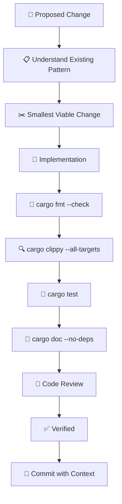

# craft-rust-maintainer

A CRAFT harness for Rust code maintenance, review, and release hygiene.

## Philosophy

> "Safe, maintainable, and reviewable Rust."

This cartridge enforces std-first thinking, explicit error handling, comprehensive testing, and strict verification gates (fmt, clippy, test) before any change is considered complete.

## Usage

Install via CRAFT CLI:
```bash
craft harness install github:Rosavera-I/craft-rust-maintainer
```

Compose with other harnesses:
```bash
craft compose rust-maintainer tdd-architect -o craft.compose.toml
craft run craft.compose.toml --prompt "Refactor error handling in the parser"
```

## Maintenance Workflow



## Review Priority


## Memory Schema

| Fact | Purpose |
|------|---------|
| `workspace_layout` | Crates, modules, responsibility boundaries |
| `quality_commands` | Format, lint, test, doc commands |
| `error_patterns` | Error type conventions (thiserror/anyhow/custom) |
| `release_notes` | User-facing changes queued |
| `msrv_policy` | Minimum Rust version and bump policy |
| `dependency_policy` | When to add deps, preferred crates, audits |
| `unsafe_invariants` | Safety requirements for unsafe blocks |
| `performance_budget` | Acceptable latency/throughput |
| `security_surface` | Crypto, parsing, network boundaries |

## Safety Checklist

- [ ] `unwrap()`/`expect()` have invariant comments
- [ ] `unsafe` has documented safety invariants
- [ ] Concurrent code is tested (stress tests, loom)
- [ ] Security-sensitive code is audited
- [ ] No shadowing in complex borrows
- [ ] Async lifetimes are correct

## Validation Checks

**Must have:**
- `cites_file_reference` — Specific files and line ranges
- `includes_verification_command` — Exact commands to run
- `preserves_existing_patterns` — Follows established conventions
- `documents_error_handling` — Error types and propagation explained
- `considers_std_first_alternative` — Justifies new dependencies
- `notes_msrv_impact` — Documents minimum Rust version changes

**Anti-patterns forbidden:**
- `claims_without_tests` — Untested assertions
- `unwrap_without_invariant_comment` — Panic risks unexplained
- `unsafe_without_safety_doc` — Undocumented unsafe blocks
- `shadowing_in_complex_borrows` — Confusing variable reuse
- `dependency_without_justification` — Unvetted crate additions
- `breaking_change_without_changelog` — Silent API breakage

## Dependency Guidelines

Before adding a crate:
1. Can std solve this? (std-first principle)
2. Is the crate actively maintained?
3. Has it had a security audit?
4. What's the compile-time and binary size cost?
5. Are there lighter alternatives?

## Example Session

```bash
$ craft run rust-maintainer --prompt "Review the network module"

🐛 Bug risk (high):
- src/net/client.rs:45: unwrap() on potential DNS failure
  Suggest: unwrap_or_else with retry logic

🕳️ Test gap (medium):
- src/net/retry.rs: No tests for exponential backoff jitter
  Suggest: Add property test for backoff bounds

⚡ Performance (low):
- src/net/buffer.rs: Vec reallocation in hot path
  Suggest: with_capacity based on typical message size

✅ Verification:
cargo fmt --check && cargo clippy --all-targets && cargo test
```

## License

MIT
