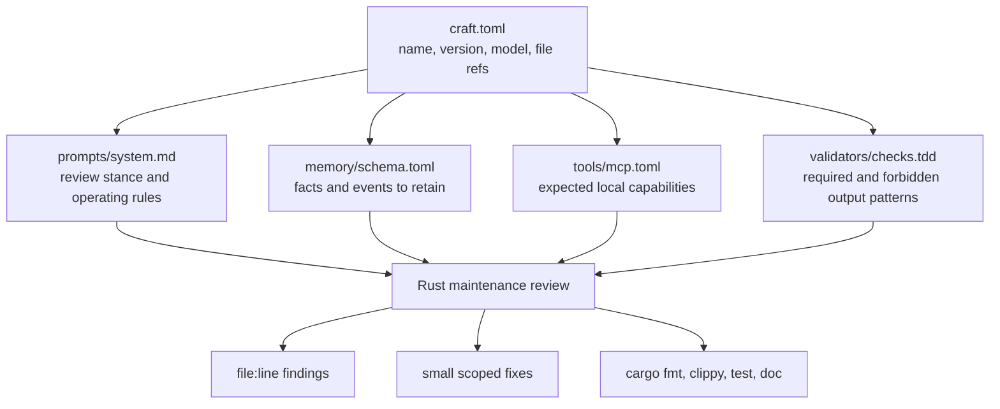
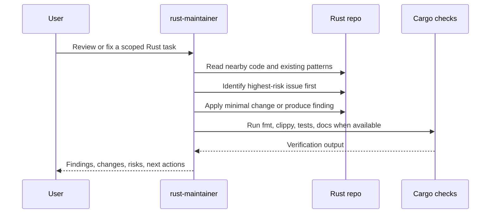

# craft-rust-maintainer Architecture

This cartridge packages Rust maintenance judgment as a CRAFT harness. It is intentionally small: the manifest points at a system prompt, memory schema, tool expectations, and validator checks that can be installed, inspected, and composed with other cartridges.

## Cartridge Shape



## Review Loop



The harness prioritizes correctness over broad cleanup. It should lead with concrete bugs, soundness risks, panic paths, missing tests, and release hazards before style suggestions.

## Composition

`rust-maintainer` composes well with:

| Cartridge | Use Together For |
|---|---|
| `tdd-architect` | Refactors that need acceptance criteria and test-first sequencing |
| `godot-designer` | Rust tooling around Godot asset pipelines or game support services |

```sh
craft compose rust-maintainer tdd-architect -o craft.compose.toml
craft run craft.compose.toml --prompt "Refactor parser errors with tests first"
```

When composed, the Rust cartridge should still own Rust-specific safety, dependency, MSRV, and verification decisions.

## Verification Contract

Preferred verification for a changed Rust workspace:

```sh
cargo fmt --check
cargo clippy --all-targets -- -D warnings
cargo test --all-targets
cargo test --doc
cargo doc --no-deps
```

If a command cannot run, the harness should say why and keep the claim scoped to what was actually verified.
